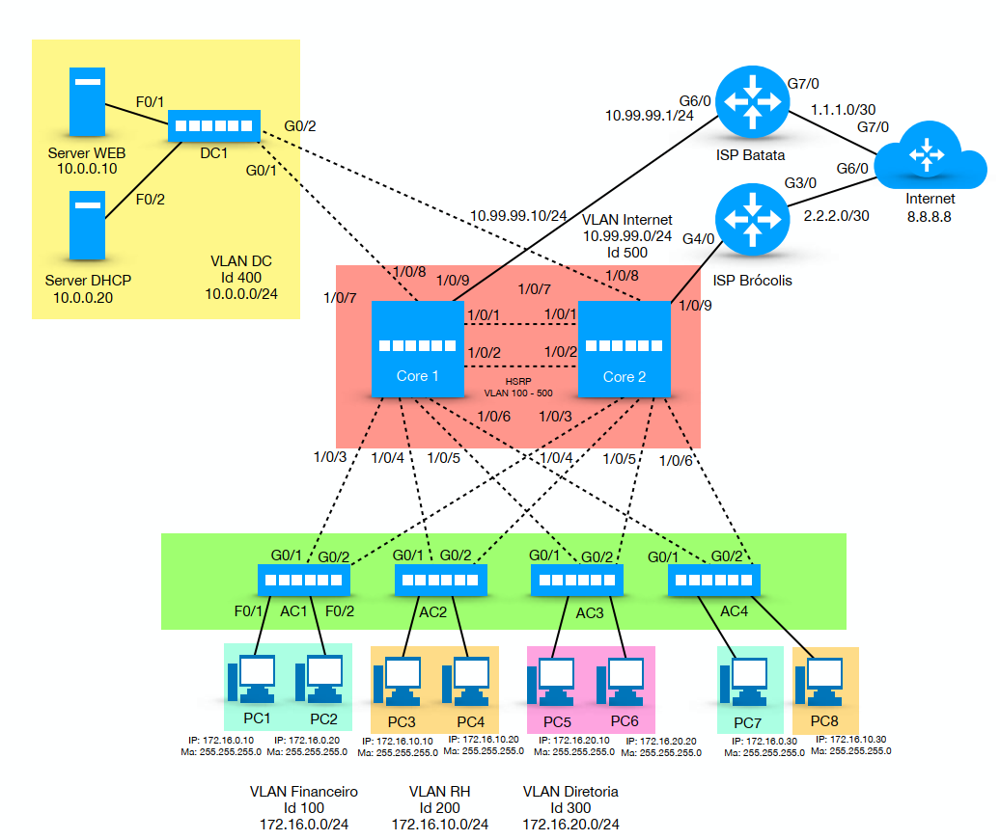

# Redes Mão na Massa
Laboratório prático dedicado a explorar conceitos básicos de redes, contemplando a configuração de switches, roteadores, VLANs, Etherchannel, STP, HSRP e simulação de conectividade com ISPs e Internet.
## Versão 1 - 2020

